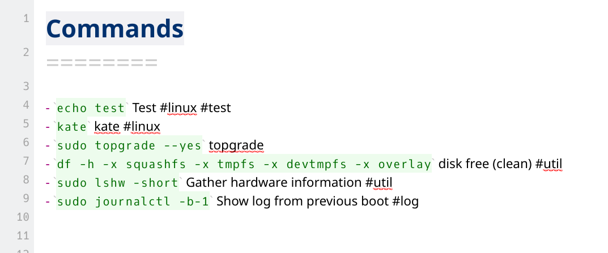

# QOwnNotes command-line snippet manager

[GitHub](https://github.com/qownnotes/qc) |
[Changelog](https://github.com/qownnotes/qc/blob/main/CHANGELOG.md) |
[Releases](https://github.com/qownnotes/qc/releases)

You can use the **QOwnNotes command-line snippet manager** to **execute command snippets** stored
in **notes** in [QOwnNotes](https://www.qownnotes.org/) from the command line.


You can use **notes with a special tag** (`commands` by default) to store **command snippets**, which you can
**execute from the command-line snippet manager**.



For more information on **how to add commands and configuration** please see
[Command-line Snippet Manager](https://www.qownnotes.org/getting-started/command-line-snippet-manager.html).

The QOwnNotes command-line snippet manager is based on the wonderful
[pet CLI Snippet Manager](https://github.com/knqyf263/pet).

## Dependencies

[fzf](https://github.com/junegunn/fzf) (fuzzy search) or [peco](https://github.com/peco/peco)
(older, but more likely to be installed by default) need to be installed to search
for commands on the command-line.

By default `fzf` is used for searching, but you can use `peco` by setting it with `qc configure`.

## Usage

```
Usage:
qc [command]

Available Commands:
completion  generate the autocompletion script for the specified shell
configure   Edit config file
exec        Run the selected commands
help        Help about any command
search      Search snippets
version     Print the version number

Flags:
--config string   config file (default is $HOME/.config/qc/config.toml)
--debug           debug mode
-h, --help        help for qc

Use "qc [command] --help" for more information about a command.
```

# Configuration

Run `qc configure`.

```toml
[General]
  editor = "vim"            # your favorite text editor
  column = 40               # column size for list command
  selectcmd = "fzf"         # selector command for edit command (fzf or peco)
  sortby = ""               # specify how snippets get sorted (recency (default), -recency, description, -description, command, -command, output, -output)

[QOwnNotes]
  token = "MvtagWXF"        # your QOwnNotes API token
  websocket_port = 22222    # websocket port in QOwnNotes
```
